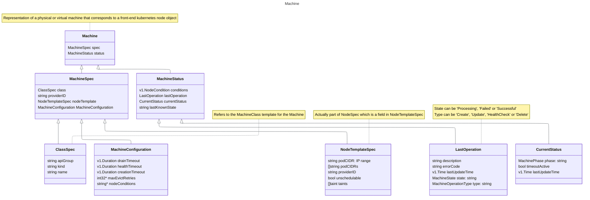
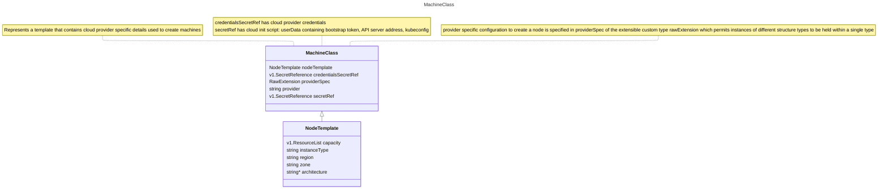
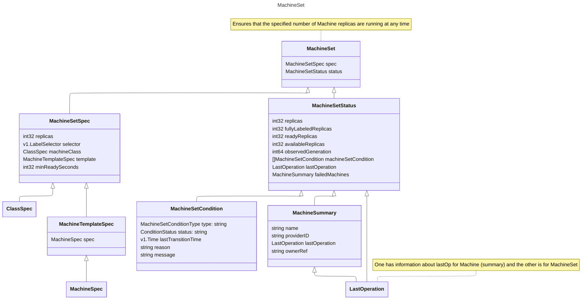
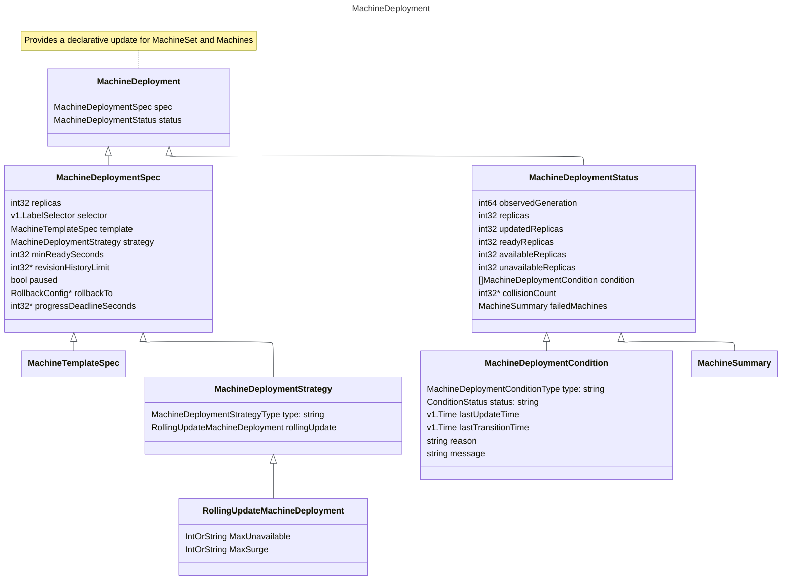
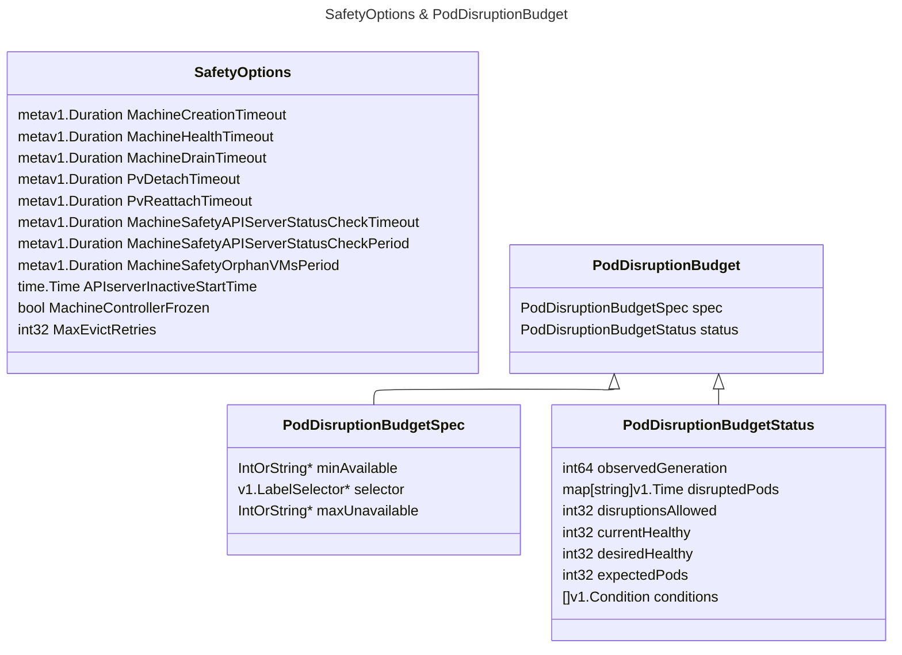
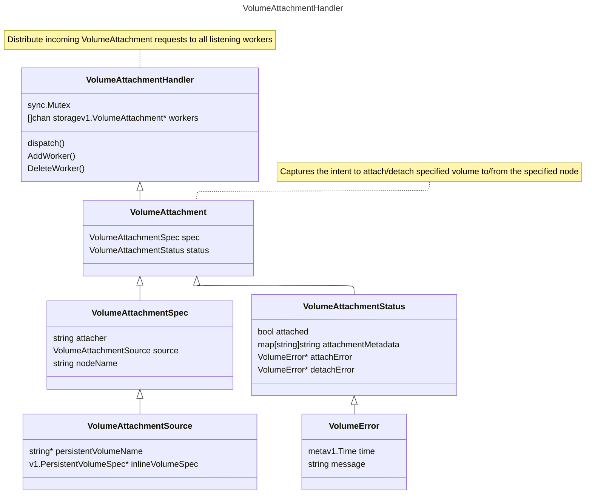

+++
title = "MCM"
author = ["Tak"]
date = 2024-11-29T16:07:00+05:30
tags = ["k8s", "work"]
draft = false
+++

First, go through the [README](https://github.com/gardener/machine-controller-manager/blob/master/README.md), later on check [local setup](https://github.com/gardener/machine-controller-manager/blob/master/docs/development/local_setup.md) guide as well.


## Components {#components}

Check [CRDs present in the MCM tree](https://github.com/gardener/machine-controller-manager/tree/master/kubernetes/crds)

<div class="warning">

All the below class diagrams omit `TypeMeta` and `ObjectMeta` for brevity.

</div>


### Machine {#machine}




### Machine Class {#machine-class}




### Machine Set {#machine-set}




### Machine Deployment {#machine-deployment}




### Miscellaneous {#miscellaneous}

<div class="warning">

These are added for reference purpose only, no need to delve too much into dissecting them.

</div>






## Machine Controller {#machine-controller}


### Reconcile Cluster Secret {#reconcile-cluster-secret}

1.  Fetch secrets
2.  Get the `MachineClass` referring to the passed secret
3.  In case there are machine classes that refer it, add the finalizer to the secret else remove it. (The removal of the finalizer is needed because if the secrets aren't referred by `MachineClass` then their deletion shouldn't depend on the finalizer, [Ref](https://kubernetes.io/docs/concepts/overview/working-with-objects/finalizers/))


### Reconcile Cluster Machine Class {#reconcile-cluster-machine-class}

1.  Fetch the `MachineClass`
2.  Get all the `Machines` referring to the `MachineClass`.
3.  If there are machines that match given `MachineClass` and the deletion hasn't been requested yet for the `Class` then add the finalizers to the class proceeding which all the machines referring to the class are enqueued for further processing. (`TODO`: Learn about [workqueue](https://pkg.go.dev/k8s.io/client-go/util/workqueue))
4.  Otherwise if deletion isn't scheduled and there are machines referring to the Class then add them to the `machineQueue`.
5.  If there aren't any machines referring to the `Class`, then the finalizers, if any, on it can be deleted.


### Reconcile Cluster Machine {#reconcile-cluster-machine}

1.  Fetch the required `Machine`.
2.  Check if the Machine controller is frozen (`MachineControllerFrozen`) and machine isn't scheduled for deletion. If so, retry reconciliation after `longRetry`.
3.  If machine isn't frozen, then validate the `Machine` (check Name and Kind for the Class shouldn't be empty). Also validate the `MachineClass`' `Nodetemplate` fields (`capacity`: cpu, gpu and memory; `instanceType`, `region` and `zone`).
4.  In case the machine is scheduled for deletion, [TriggerDeletionFlow](#triggerdeletionflow) with a `DeleteMachineRequest`.
5.  If the `Machine` isn't scheduled for deletion, then add the finalizers on the machine if not present.
6.  Check [Machine Phases State Diagram](https://github.com/gardener/machine-controller-manager/blob/master/docs/FAQ.md#what-are-the-different-phases-of-a-machine)

    Check if the machine has an associated node (look for _label_ with key "`node`") and if the machine has been created (i.e. `phase` != "", if phase is empty string, that corresponds to machine being in creation stage). If so, then:

    -   Reconcile Machine Health: Updates the machine object with any change in node conditions or health. [Ref](https://elankath.github.io/mcmdesign/machine-controller/cluster_machine_reconcile.html#health-check-summary)
    -   Sync Machine Name to Node: Syncs machine name on corresponding node object by adding machine name label to metadata.
    -   Sync Machine NodeTemplates: Syncs `nodeTemplate` between the machine and the node object by fetching it, then syncs the _annotations_, _labels_ and _taints_ ().
7.  If machine phase is `empty` or `crashloopbackoff` or `providerId` is empty i.e. machine doesn't exist then [TriggerCreationFlow](#triggercreationflow) with `CreateMachineRequest`.


#### TriggerDeletionFlow {#triggerdeletionflow}

Check out [FAQ: Why is my machine deleted?](https://github.com/gardener/machine-controller-manager/blob/master/docs/FAQ.md#why-is-my-machine-deleted)
Check if finalizers are present on the machine, if not retry after a while. In case they are present and the machine isn't in `terminating` phase, then set it to `terminating` (also sets `LastOperation` state to `Processing` and description to `GetVMStatus`). If machine is in `terminating` phase, then check `LastOperation Description`:

1.  If it contains the string `GetVMStatus` i.e. _"Set machine status to termination. Now, getting VM Status"_ then `updateMachineStatus&NodeLabel` is called which adds the "`node`" label if not present while checking for any errors in getting machine error status. After confirming that the node label is updated, the LastOperation `type` is set to `delete` and LastOperation `description` to `InitiateDrain`.
2.  If it contains the string `InitiateDrain` then call [DrainNode](#drainnode).
3.  If its `DelVolumesAttachments`, then `deleteNodeVA` is invoked:
    -   If node is not found or if `node.VolumesAttached` is zero then `description` is updated to `InitiateVMDeletion` and `state` is set to `Processing`.
    -   If there are non-zero attached volumes then `getLiveVAForNode` fetches all the volumes attached to our node not having DeletionTimestamp set.
    -   If there are live volumes, `deleteVAForNode` removes them and when zero live volumes are attached then `InitiateVMDeletion` is set as the `description`.
    -   After this the machine status is updated with the corresponding state and description.
4.  When it's `InitiateVMDeletion`, then `deleteVM` delgates the task to driver.[DeleteMachine](#deletemachine) method. If deletion is successful then description is set to `InitiateNodeDeletion` with `processing` `state`. If there are any errors:
    -   In case its `NotFound`, then deletion flow is continued and `state` is set to `processing` with `description` as `InitiateNodeDeletion`.
    -   If it's `Unknown`, `DeadlineExceeded`, `Aborted` or `Unavailable` or any other error code(`default`) or failure in decoding the machineErr itself: the `state` is set as `failed` and `description` remains `InitiateVMDeletion` as deletion is re-tried.
    -   After this the machine status is updated with the corresponding state and description.
5.  Whereas `InitiateNodeDeletion` calls upon `deleteNodeObject` which if it can't find the associated node, continues the deletion flow with `description` set to `InitiateFinalizerRemoval` and sets the `state` as `Processing` otherwise `Delete()` is called for the node which on success moves the state to `Processing` and `InitiateFinalizerRemoval` stages however on error switches to `failed` state (any error other than object not found). After this the machine status is updated.
6.  At last when we have `InitiateFinalizerRemoval`, `deleteMachineFinalizers` is invoked which deletes `MCMFinalizerName` if present, if there are any errors while updating the machine with the new set of finalizers, then re-queue is triggered after a ShortRetry.


#### DrainNode {#drainnode}

Check out [FAQ: How is drain implemented?](https://github.com/gardener/machine-controller-manager/blob/master/docs/FAQ.md#how-is-the-drain-of-a-machine-implemented), and the [flowchart](https://elankath.github.io/mcmdesign/machine-controller/mc_helper_methods.html#controllerdrainnode).

1.  Check that the nodeName is valid, if not set `skipDrain`.
2.  Check if machine is in `Ready` or `ReadOnly` state.
3.  If node condition is not empty and its `not Ready` or its `ReadOnly` and it's been 5mins, then `forceDeleteMachines` and `forceDeletePods` labels are set, `printLogInitError()` is called i.e. `description` is set to `InitiateVMDeletion`.
4.  If skip isn't set, then check if (MachineDrainTimeout) has occured.
    -   If `force-deletion` label is present on the machine or if timeout has happened then `forceDeleteMachines` and `forceDeletePods` labels are set and _force deletion_ is triggered otherwise _normal deletion_ is triggered.
    -   After that, `UpdateNode TerminationCondition` is called, which checks that the `phase` is not `CrashLoopBackOff` or `empty` i.e. machine is not in creation stage. Then we check if there are nodes that are already in `terminating` condition, if not, then if `phase` is `failed` then `terminationCondition` reason is set to `Unhealthy`, otherwise it's set to `ScaleDown`.
    -   If termination condition update results in an error in a _normal deletion_ then, `skipDrain` is set and `state` is set to `failed`.
    -   If termination condition update doesn't result in an error then [RunDrain](#rundrain) is invoked; if drain is successful then `state` is set to `Processing` &amp; if it's _normal deletion_ `description` is set to `InitiateVMDeletion` (since regular deletion already waits for volume detach/attach) otherwise if it's _force deletion_ then `description` is set to `DelVolumesAttachments`  alongwith `Processing` `state`. If `RunDrain` is unsuccessful however and its _normal deletion_ then `description` is set to `InitiateDrain` with `failed` `state` for a retry.
    -   To summarize the above:
        ```nil
           To perform forceful machine drain/delete either:
           1. force-deletion: "True" label must be present
           2. Deletion operation is more than drain-timeout minutes old
           3. Last machine drain had failed
        ```

5.  If `skipDrain` is set, then set the state to `Processing`, LastOperation `type` to `delete`, `description` is set to `InitiateVMDeletion` by `printLogInitError()` and it's re-queued.


#### RunDrain {#rundrain}

1.  drainContext
2.  `RunCordonOrUncordon`

    First we try to get the associated node, if it results in an error that means the node doesn't exist i.e. deletion was triggered during the machine creation process hence there's nothing to do. If the node is there and it's `Spec.Unschedulable` is true, then there's nothing to do otherwise `Unschedulable` is set to true. (_Cordoning_ means sealing off/preventing access)
3.  `WaitForCacheSync` is processed for the pod informer cache to sync.
4.  `deleteOrEvictPodsSimple`
    -   Calls `getPodsForDeletion` which lists all `pods.Spec.NodeName` matching our node, (TODO: check podFilter) and if there aren't any errors, then returns the list of pods.
    -   Following which we `deleteOrEvictPods`: Here, we first check if the server supports eviction by `SupportEviction` and if `ForceDeletePods` is false then we call `evictPods` which performs _normal eviction_ of the pods, parallelly `evictPodsWithoutPv` and serially (by sorting by Priority) `evictPodsWithPv` for ones having volume attached since it needs to wait for volume detachment. Both of these ways attempt to `evictPod` if supported for `MaxEvictRetries` times failing which they `deletePod`. If `forceDeletePods` is true, then _forceful eviction_ of the pods happens and all pods are evicted parallelly by calling `evictPodsWithPv`.
    -   In case there are errors while performing either _evictPod_ or _deletePod_, it could be that the pod wasn't evicted due to PDB violation, hence we get the PDB for the pod and check if its misconfigured by verifying that the `Generation` is same as `Status.ObservedGeneration` and that `CurrentHealthy` pods are more than `ExpectedPods` (which should be more than 0) and `DisruptionsAllowed` is zero. All these scenarios result in a misconfigured PDB.
    -   If it's not a case of misconfigured PDB then we sleep for `PodEvictionRetryInterval` and then move to next iteration of the eviction attempt. `TODO` `TerminationGracePeriod`, `waitForDelete`

        References: [Disruptions](https://kubernetes.io/docs/concepts/workloads/pods/disruptions/), [Configuring PDB](https://kubernetes.io/docs/tasks/run-application/configure-pdb/), [API Eviction](https://kubernetes.io/docs/concepts/scheduling-eviction/api-eviction/), [evictPodsWoPVInternal](https://elankath.github.io/mcmdesign/machine-controller/node_drain.html#drainoptionsevictpodwithoutpvinternal)
    -   `TODO` Check [evictPodsWithPVInternal](https://elankath.github.io/mcmdesign/machine-controller/node_drain.html#drainoptionsevictpodswithpvinternal)
    -   If there are any failures in `deleteOrEvictPods`, they are reported as pendingPods.


#### TriggerCreationFlow {#triggercreationflow}

1.  Update MachineRequest's secret by processing the secret with (TODO) `addBootstrapTokenToUserData` and `addMachineNameToUserData` which checks if `secret["userData"]` exists, then replacing `MachineNamePlaceholder` &lt;MACHINE_NAME&gt; with the actual `machine.Name`.
2.  After that, the secret is used alongwith the Machine and MachineClass to create a [GetMachineStatus](#getmachinestatus)Request which responds with `providerId` and associated `nodeName`.
3.  If there is no error with the GetMachineStatusRequest and the machine's "node" label or `providerID` is empty then the required VM is found and the node and providerID for the machine is updated. (`updateLabels`: adds the necessary labels, annotations with MachinePriority as 3 if unset and updates the providerID)
4.  If there is an error in getting the machine status and the ErrCode is `NotFound` or `Unimplemented` and if the "node" label is not present on the machine then: driver.[CreateMachine](#createmachine)() is invoked which on success gives us the `providerId` and the `nodeName`, then we try to `Get()` (TODO: nodeName != machineName significance?) the returned `nodeName` to check if a node object already exists. If so, it is treated as a stale node and `driver.DeleteMachine()` is triggered and the machine object is marked as `state` `failed`, `phase` being `failed`  with LastOperation `description` set as "`VM using old node obj`" and then its status is updated. NOTE: Also, `uninitializedMachine` is set to true.
5.  If the returned codes are `Unknown`, `DeadlineExceeded`, `Aborted` or `Unavailable`, then again `machineStatusUpdate` is called with `state` set to `failed` and `phase` being `failed` or `crashloopbackoff` depending upon whether or not MachineCreationTimeout happened.
6.  Whereas the case when returned code is `Uninitialized`, the flag `uninitializedMachine` is set to true. In any other scenario, a `machineStatusUpdate` call similar to the previous case is made with a re-queue call.
7.  In case the `uninitializedMachine` flag is set, `initializeMachine` is called for starting the VM instance for the machine, it delegates the task to driver.[InitializeMachine](#initializemachine) which if it returns `Unimplemented` error code, then VM initialization is skipped as provider doesn't support it otherwise `machineStatusUpdate` call is made with `failed` `state` and `crashloopbackoff` or `failed` `phase` based on MachineCreationTimeout. Upon successful initialization, an error is returned by `triggerCreationFlow` for another re-queue.
8.  If however the machine `phase` is `empty` (creation) or `crashloopbackoff` then `state` is set as `Processing`, `phase` as `Pending` and a `UpdateStatus` call is made for the machine.


## Safety Controller {#safety-controller}


### Reconcile Cluster Machine Safety Orphan VMs {#reconcile-cluster-machine-safety-orphan-vms}

It lists all the VMs in the cloud matching the `tag` of given cluster name and maps the VMs with the `machine` objects using the `ProviderID` field. VMs without any backing machine objects are logged and deleted after confirmation. It runs every `MachineSafetyOrphanVMsPeriod` duration (15 mins). It runs:

1.  `checkMachineClasses`: fetches all the MachineClasses and for each of them calls `checkMachineClass`:
    -   It fetches their `secretData`, lists all the `Machines` referencing that class, updates their cache via `WaitForCacheSync`
    -   Then it iterates over the MachineList returned by [ListMachines](#listmachines): `<providerID, machineName>`, fetching each machine and ensuring that the providerID matches.
    -   If it doesn't and the `phase` is "" or `crashloopbackoff`, then it continues iterating otherwise it creates a dummy machine object for `DeleteMachineRequest`.
2.  `AnnotateNodesUnmanagedByMCM`: fetches all the nodes on the target cluster then iterates over them:
    -   Calls `getMachineFromNode` which returns `errMultipleMachineMatch` or `errNoMachineMatch` depending on the number of machines associated with the node. If there's only one machine, then it returns the machine.
    -   If we get `errNoMachineMatch` then we compare `currentTime - nodeCreationTime` with MachineCreationTimeout, if timeout has occured and the node doesn't have `NotManagedByMCM` annotation present on it then it means there's no backing machine object for the node. So we annotate it with `NotManagedByMCM` and then update the node.
    -   If it returns the machine having `NotManagedByMCM` annotation then we remove the annotation and update the node.


### Reconcile Cluster Machine Safety API Server {#reconcile-cluster-machine-safety-api-server}

Freezes `MachineDeployment` and `MachineSet` controller if number of `machine` objects goes beyond a certain threshold on top of `Spec.Replicas` by applying a `freeze` label. It also freezes the functionality of MCM if `target-apiserver` or `control-apiserver` is not reachable and unfreezes once situation becomes normal.

1.  Checks if `MachineControllerFrozen` is true if it is, then it checks if `isApiServerUp`.
2.  `isApiServerUp` makes a dummy call to control APIServer (`controlMachineClient`) and target APIServer (`targetCoreClient`) and if either gives an error different from isNotFound error, it returns false. If it returns true then we unfreeze them by iterating over them and if their `phase` is `Unknown`, we get machine from `controlMachineClient` and set the phase as `Running`, `state` as `successful` and `description` as _"Machine Health Timeout was reset due to APIServer being unreachable"_. After which we update the status and `enqueueMachineAfter` 30 seconds for reconcile and set `MachineControllerFrozen` to false &amp; `APIserverInactiveStartTime` to nil.
3.  If initially `MachineControllerFrozen` was false, and `isApiServerUp` returned false i.e. its not up then we set `APIserverInactiveStartTime` as current time if its unset and check if time passed since Inactive time is more than `MachineSafety APIServer StatusCheckTimeout`, if so we set `MachineControllerFrozen` to true and then re-enqueue the API Server check.


## Machine Controller Manager {#machine-controller-manager}

Handles reconciliation of `MachineDeployment` and `MachineSet` objects.


### Reconcile Cluster Machine Set {#reconcile-cluster-machine-set}

-   Fetch the `MachineSet`.
-   `ValidateMachineSetSpec`: Ensures that `spec.Replicas` is greater than or equal to zero and `selector.matchLabels` matches `template.metadata.labels`.
-   If DeletionTimestamp is not set, then `addMachineSetFinalizers`
-   LabelSelectorAsSelector converts MachineSet selector to a selector object that's used by `claimMachines` function that creates a `*Machine Controller Ref Manager*` tagged with a `CanAdopt` function that first fetches `fresh` i.e. latest version of the machineSet and then verifies its UID with the existing `machineSet`'s UID to ensure that the machineSet isn't being deleted. (This function is later used by `AdoptMachine`)
-   `ClaimMachine` indirectly calls `ClaimObject` with `Match`, `Adopt` and `Release`:
    1.  `Match`: Checks if the selector matches, after which it runs a set of `filter` functions. On success, it returns true.
    2.  `AdoptMachine` (Adopt): Runs the previously created `CanAdopt` function to verify that the machine can be adopted by the machineSet, if so then `PatchMachine` with the _OwnerRef_ to the MachineSet and add to `claimedMachines`.
    3.  `ReleaseMachine` (Release): Sends a `deleteOwnerRefPatch` to free the Machine from controller. On patching, `NotFound` and `IsInvalid` errors are ignored since if the machine doesn't exist or if it has no ownerRef or if the UID doesn't match (implies machine was recreated after deletion) then it's fine.
-   ClaimObject:
    ```nil
    It will reconcile the following:
    ​  - Adopt orphans if the match function returns true.
    ​  - Release owned objects if the match function returns false.
    ```

    1.  Get the `ownerRef` using `GetControllerOf`, it it's not nil, check if
        ownerRef.UID is the same as the machineSet's UUID. ([UID](https://kubernetes.io/docs/concepts/overview/working-with-objects/names/#uids) is k8s system generated string to uniquely identify object).  If the DeletionTimestamp is not set (nil), and the selector `match` fails, then attempt a `release`.
    2.  In case the ownerRef was nil, check if machineSet is not scheduled for deletion (`DeletionTimestamp` nil) and the `match` was succesful. If so, then if the machine isn't scheduled for deletion, attempt `Adopt`.
-   After the list of claimedMachines if procured, we call `syncMachinesNodeTemplates`, `syncMachinesConfig` &amp; `syncMachineClassKind` which goes through the list and checks if a machine requires updation of the `Nodetemplate`, `MachineConfiguration` and `Class.Kind` and copies them from the `machineSet` to the `machine` if needed.
-   Then check if the _machineSet_ is scheduled for deletion i.e. `DeletionTimestamp` is not nil, if there aren't any claimedMachines for this machineSet (len(filteredMachines) is 0) then remove the finalizer from the _machineSet_ otherwise trigger deletion of the claimedMachines via `terminateMachines`.
-   In case the _machineSet_ wasn't scheduled for deletion, `manageReplicas` is called:
    1.  Gets the MetaNameSpaceKey for the _machineSet_ and creates a list of activeMachines (`phase` != `failed` or `terminating`) and staleMachines (`phase` is `failed`) from the list of claimedMachines.
    2.  If there are staleMachines then they are scheduled for deletion, `terminateMachines` is called.
    3.  Then we check the difference between the number of activeMachines and the number of `Replicas` specified by the _machineSet_.
    4.  If the activeMachines are less, then count (diff) is set to `min(BurstReplicas: 100, Replicas - len(activeMachines))` and &lt;TODO ExpectCreations&gt; `slowStartBatch` is called which calls a function `CreateMachines With ControllerRef` `count` times, starting slow with group of `SlowStartInitialBatchSize` (1) to check for errors, then speeding up if calls succeed. Within each batch, it may call the function multiple times concurrently. If a whole batch succeeds, the next batch gets exponentially larger.
    5.  &lt;TODO&gt; skippedMachines CreationObserved
    6.  In case the activeMachines are more than the `Replica` count, then deletion must be triggered. `diff` is set to `min(BurstReplicas: 100, len(activeMachines) - Replicas)` and then the activeMachines are sorted in the order `NonReady, Ready, Unscheduled, Scheduled, Pending, Running`. &lt;TODO: ExpectDeletions&gt;. After getting the sorted list, the machines are deleted by called `terminateMachines`.
-   Then MachineSet status is calculated and updated following which reconcile is enqueued after 10 minutes.


### Reconcile Cluster Machine Deployment {#reconcile-cluster-machine-deployment}

-   Fetch the deployment by getting the name from `SplitMetaNamespaceKey`, then validate it by ensuring `Replicas` is not negative and that `selector.matchLabels` is consistent with `template.metadata.labels`.
-   Add finalizers if DeletionTimestamp is nil, then check if `Selector` is empty i.e. the deployment is selecting all machines, if so record that event and set `Status.ObservedGeneration` to `Generation` if it's less and then update the status.
-   Then `getMachineSets` is called which uses a controller reference manager to handle ownership and internally calls `ClaimMachineSets` (acts in a similar fashion to `ClaimMachine` in [Reconcile Cluster Machine Set](#reconcile-cluster-machine-set) by leveraging `ClaimObject` however it doesn't run any filters) to get the machineSets owned by the deployment via adoption/orphaning with a similar `CanAdopt` function that fetches a fresh copy of the deployment object and compares UID to ensure that the deployment isn't being deleted.
-   `getMachineMap`: Creates a map from MachineSet UID to list of Machines it controls; used to verify machine labels and handle recreate deployments; it groups machines by their controller reference.
-   If DeletionTimestamp is set **and** deployment has `DeleteFinalizerName` **and** if there are no MachineSets referring to the deployment _then_ remove the finalizers. If there are MachineSets owned by the deployment then `terminateMachineSets` is called after which `syncStatusOnly` calls `getMSAndSyncRevision` that lists the _old_ and new (**with updated revision**) MachineSets and machines for the deployment and applies `machine-template-hash` to the adopted ones and then deployment status is synced.
-   Ref: [Pausing a deployment](https://kubernetes.io/docs/concepts/workloads/controllers/deployment/#pausing-and-resuming-a-deployment), [Deployment Status](https://kubernetes.io/docs/concepts/workloads/controllers/deployment/#deployment-status) &lt;TODO: Why?! are we doing this&gt;
    `checkPausedConditions` fetches the condition with `type` as `Progressing`
    1.  If `cond.Reason` is `TimedOutReason`, return without overwriting with  paused condition.
    2.  Check if `pausedCondExists` by seeing if cond.Reason is `PausedMachineDeployReason`.
    3.  If `Spec.Paused` is true and `pausedCondExists` is false, then update the condition with `Reason` as `PausedMachineDeployReason` and `message` as _"Deployment is paused"_.
    4.  Otherwise if `Spec.Paused` is false and `pausedCondExists` is true, then update the condition with `Reason` as `ResumedMachineDeployReason` and `message` as _"Deployment is resumed"_.
    5.  Update the deployment status.
-   Then we check if `Spec.Paused` is true, if so it implies that _Scaling was detected for deployment which is paused_, so `sync` is called (which has the responsibility of reconciling deployments on scaling/when paused)
    1.  First `getMSAndSyncRevision` is called to get list of new and old machineSets.
    2.  Then [Scale](#scale)() method is invoked, following which `spec.Paused` is checked, if deployment is paused and there's no rollback in progress i.e. `spec.RollbackTo` is nil, then deployment `cleanup` is called for. The cleanup filters the old machineSet to get ones which are currently active (i.e. DeletionTimestamp is not set) and then deletes (note that if any delete fails, it stops the cleanup process since the failure could be due to api server overload) all but `RevisionHistoryLimit` number of machineSets (in this process it checks if the filtered machineSets have non-zero replica counts and avoids deleting them).
    3.  Otherwise the new machineSets, if any are added to set of all machineSets and their status is synced by calling `sync MachineDeployment Status`.
-   If the deployment wasn't paused and `Spec.RollbackTo` is non-nil i.e. there exists a revision that the deployment is rolling back to, the `rollback()` method is invoked:
    1.  First `getMSAndSyncRevision` is called to get list of new and old machineSets.
    2.  Ref: [k8s rollbacks](https://learnk8s.io/kubernetes-rollbacks), Then we check the rollback revision version (`RollbackTo.Revision`), if its zero then we find the `LastRevision()` i.e. second max revision number by iterating over all machineSets and if its also zero, then that means we were unable to find the last revision and we give up rollback (_update Deployment and Clear Rollback_ To is called)
    3.  Otherwise we proceed with the rollback: Iterating over the list of machineSets, we get the `Revision` for each machineSet and if it matches the `RollbackTo.Revision`, then the `PreferNoSchedule` taint is removed from the nodes which are backing that machineSet.
    4.  After taint removal, `rollbackToTemplate()` method is called which compares the templates (hash) of the deployment with the matching machineSet and updates the the _template_ of the deployment incase they're different (Set From Machine Set Template) and the _annotations_ of the deployment to the rollbacked machineSet revision (Set Machine Deployment Annotations To).
-   If it wasn't a rollback event either, then we check if its a `ScalingEvent` i.e. there are activeMachineSets (found by filtering as new MachineSets with Replicas more than 0). For scaling events `sync` is called (check above Paused discussion to see what it does)
    1.  In case there's no activeMachineSets and the `Replicas` on the deployment is more than 0 i.e. its a _scale from zero_ scenario so its considered as a scalingEvent.
    2.  Otherwise when there are activeMachineSets with `desired-replicas` annotation not equal to the deployment replicas then also its a scalingEvent.
    3.  If no such machineSets exist i.e. all the active ones have the same amount of desired-replicas as the deployment replica then its not a scaling event.
-   In case none of the scenarios were true i.e. not paused, not rolling back, and not scaling, then we execute the deployment strategy which is either [Recreate](#recreate) or [Rolling](#rolling).


#### <span class="org-todo todo TODO">TODO</span> Scale {#scale}


#### Recreate {#recreate}

-   First `getMSAndSyncRevision` is called to get list of new and old machineSets. Old MS is filtered to find the active ones i.e. those having non-zero replicas.
-   Create annotations to disable CA performing scale-downs during rollout and apply them to all machineSets if `autoscaler ScaleDown Annotation During Rollout` bool is true _and_ there are old MS that haven't been scaled to zero yet.
-   Then activeOld MS are scaled down:
    1.  If replica for the MS is already zero then scaling is not required.
    2.  Otherwise MS has to be scaled-down, its annotated with `desiredReplicas` being the deployment Replicas and the `maxReplicas` being `maxSurge` amount more than that. `maxSurge` is 0 for _non-rolling_ updates.
    3.  In case scaling was required, after adding the annotations, the old MS is updated.
-   If a scale-down occured or if there are old MS having non-zero replicas then, `Sync RolloutStatus` is invoked:
    1.  TODO calculateDeploymentStatus
    2.  Then we get all the MD conditions having `type` as `Progressing` and check if the current deployment is complete or not by:
        -   Ensuring `Replicas` and `UpdatedReplicas` are the same
        -   There is a MD condition of `Progressing Type` having `Reason` as "_New Machine Set Available_".
    3.  If its not a complete deployment then i.e. rollout hasn't happened then progress estimation happens:
        -   In case deployment is **completed** (UpdatedReplicas, AvailableReplicas and Replicas are the same and new ObserverGen is more than or equal to MD generation) i.e. all desired replicas are updated and available, no old machine are running; then the condition is updated to `Progressing` with  "_New Machine Set Available_" (The conditions talked about in the previous point).
        -   If its in **progressing** state, then the progress is estimated by comparing the current and new status of the deployment. Specifically, when new machines are scaled up or become ready/available or old machines are scaled down. In this case, the `Reason` is set to "_Machine Set Updated_".
        -   If its in **timed out** state, then "Progressing" state is set to false and the reason is updated as "_Progress Deadline Exceeded_".
    4.  Then we fetch all the failure conditions of the `type` "_Replica Failure_" for MS and convert them to deployment conditions. In case we don't find any, we remove "Replica Failure" condition from the deployment if present.
    5.  If there aren't any status changes to be done on the deployment, then its re-queued otherwise the status is updated.
-   If there is a need to create new MS i.e. new MS from initial `getMSAndSyncRevision` is nil, then the function is called again with the creation flag set to true which creates the new MS.
-   The new MS are scaled up to deployment's `Replicas` count and the annotations for `desiredReplicas` and `maxReplicas` are added.
-   Again the progress is estimated and if deployment is **completed** then, autoscaler annotations are removed, deployment is _cleaned up_. At the end `Sync RolloutStatus` is called again.


#### Rolling {#rolling}

-   First `getMSAndSyncRevision` is called to get list of new and old machineSets. Create annotations to disable CA performing scale-downs during rollout and apply them to all machineSets if `autoscaler ScaleDown Annotation During Rollout` bool is true _and_ there are old MS that haven't been scaled to zero yet.
-   Also, nodes backing all the old MS have "PreferNoSchedule" taint added to them to avoid scheduling on them. And `reconcileNewMS` is called to try to scale up, if possible:
    1.  Check if newMS.Replicas is same as deployment's Replicas, that means there's no scaling needed.
    2.  If newMS.Replicas are more then scale-down needs to happen alongwith updation of `desiredReplicas` and `maxReplicas` annotation. In cases of rolling updates, `surge` is not simply 0 it is calculated via `ResolveFenceposts` as \\(surge = \lceil\frac{maxSurge \* Replicas}{100}\rceil\\) when `maxSurge` is passed as a % value otherwise its taken as is. And the `maxReplicas` value is annotated as `Replicas + surge`
    3.  If its neither, then scale-up needs to happen, `NewISNewReplicas` is used to get the target Replicas count, first `surge` is computed in a similar fashion as above and then `maxReplicas` is compared with currently active MS replica count. If the current count is more i.e. scale up is not possible and target count is returned the same as newMS replicas count otherwise scale up needs to happen by
        ```nil
        min(max - current, dep.Replicas - newMS.Replicas)
        ```
        and `scaleUp + newIS.Replicas` is returned as the target replicas count.
    4.  If any scaling happens, then `Sync RolloutStatus` is called to update the deployment status.
-   After this an attempt is made to scale-down the active oldMS. First check if their total replica count is 0 in which case no further scale-down is possible. Otherwise we attempt the scale-down:
    1.  Check minAvailable needed number of replicas, `deployment.Replicas - unavailable` where it is calculated via `ResolveFenceposts` as \\(unavail = \lfloor\frac{maxUnavailable \* Replicas}{100}\rfloor\\) when `maxAvailable` is passed as a % value otherwise its taken as is.
    2.  Check newMS that are still unavailable, `newMS.Replicas - newMS.AvailableReplicas`
    3.  Hence there by removing (minAvailable + newMSUnavailable) from total active replicas, we get the number of replicas that can be cleanup up without any issues. (maxScaledDown)
    4.  An attempt is made to clean up those replicas from the oldMS where first oldMS are sorted in the order `notready, ready, unscheduled, scheduled, pending, running` so that unhealthy replicas are cleaned up before to not increase unavailability:
        -   Iterating over the sorted oldMS, we first check if the targetMS's replica count is 0 or equal to its availableReplicas in which cases it can't be downscaled or has no unhealthy replicas so we skip its cleanup.
        -   Otherwise compute `scaledownCount` for the targetMS by
            ```nil
            min(maxCleanupCount - totalScaledDown, Replicas - AvailableReplicas)
            ```
            where `totalScaledDown` keeps incrementing by `scaleDownCount` as we iterate over all oldMS.
        -   We then compute `newReplicacount` as `Replicas - scaledownCount` and attempt to scaledown the targetMS to it. &lt;TODO: Rewrite this&gt;
    5.  After attempting the cleanup of old unhealthy MS, we them attempt a scaledown by first checking if its possible, computing `minAvailable` needed replica count and `totalAvailable` and seeing if total's less than min in which case we can't scale down. Otherwise we compute `totalScaledDownCount` (aka target) as `total - min` available replica count &amp; sort oldMS similar to how we did in the cleanup process above and start iterating over them:
        -   Check if scaling's done by comparing `totalScaledDown` number with the target in which case we stop.
        -   If MS's replicas is 0 then scaling isnt possible for it, so skip it.
        -   Otherwise scaledown is attempted with `scaleDownCount` being
            ```nil
            min(Replicas, target - totalScaledDown)
            ```
            and `newReplicacount` as `Replicas - scaleDownCount` after which `totalScaledDown` is updated with `scaleDownCount`
    6.  If any scaling happens, then `sync RolloutStatus` is invoked later for updating the status.
-   At the end, the progress is estimated and if deployment is **completed** then, autoscaler annotations are removed, deployment is _cleaned up_. At the end `Sync RolloutStatus` is called again.


### <span class="org-todo todo TODO">TODO</span> Reconcile Machine Safety Overshooting {#reconcile-machine-safety-overshooting}


## Extension {#extension}

All methods in `Driver` interface take a `Request` and provide a `Response`.

```go
type Driver interface {
    CreateMachine(context.Context, *CreateMachineRequest) (*CreateMachineResponse, error)
    InitializeMachine(context.Context, *InitializeMachineRequest) (*InitializeMachineResponse, error)
    DeleteMachine(context.Context, *DeleteMachineRequest) (*DeleteMachineResponse, error)
    GetMachineStatus(context.Context, *GetMachineStatusRequest) (*GetMachineStatusResponse, error)
    ListMachines(context.Context, *ListMachinesRequest) (*ListMachinesResponse, error)
    GetVolumeIDs(context.Context, *GetVolumeIDsRequest) (*GetVolumeIDsResponse, error)
}
```

[Machine Error Codes](https://github.com/gardener/machine-controller-manager/blob/master/docs/development/machine_error_codes.md) document goes a bit more in-depth into the workings of the various driver interface methods.

All methods follow a similar pattern at the start where they first check that the `MachineClass.provider` in the request is the correct one otherwise `InvalidArgument` is returned as the error code. Then the request's `MachineClass` and `Secret` are used to extract the `providerSpec`, validation of the spec happens during the extraction process. If there's an issue while _unmarshalling_ the `rawSpec`, `internal` error is returned and if there's an issue with validation, `InvalidArgument` is returned. The other common part is creation of a _service client_ which is handled by the `createSVC` method (takes in _region_ and _secret_).

Note that during the invocation of some methods, `Record Driver API Metric` function runs which captures the duration of the operation and records any failures. Coming to the specifics of the methods:


### CreateMachine {#createmachine}

-   Secret's `userData` is checked for existence and is encoded if found. (Later used in `RunInstancesInput`)
-   Validate given AMI's (Amazon Machine Image) existence, verify that the image exists and is valid using [DescribeImages](https://docs.aws.amazon.com/AWSEC2/latest/APIReference/API_DescribeImages.html) `POST` request.
-   Block devices are the _storage volumes_ attached to an `Instance`. And `BlockDeviceMappings` define the EBS volumes and instance store volumes to attach to an instance at launch. So using the list of devices from providerSpec and the `RootDeviceName` from the image, block device mappings are generated for storage.
-   Then tags are generated for `instance`, `volume` and `NetworkInterface`. These tags are useful as they act as identifiers which map the clusters that resources belong to and for management (cleanup, securtiy) etc. Failure in tag generation results in an `Internal` error code being returned.
-   Afterwards, `NetworkInterfaceSpec` is defined for all the interfaces and by iterative over providerSpec NetworkInterfaces. And `IamInstanceProfile` is set up by going through _IAM name and ARN_. And after that _instance metadata options_ are initialized.
-   Following all this, the `RunInstancesInput` config is initialized using all the above fetched/initialized fields. Some additional fields such as `Placement`, `Capacity Reservation Target`, `CPU Options` and `Spot Price` are further set up before the [RunInstance](https://docs.aws.amazon.com/AWSEC2/latest/APIReference/API_RunInstances.html) call which launches the EC2 instance.
-   Then we wait for the VM with `ProviderID` for machine `Name` to be visible to AWS endpoints by checking using `confirmInstance` calls following which's success the _MachineResponse_ consisting of the `ProviderID` and `Machine Name` is returned.


### InitializeMachine {#initializemachine}

`InitializeMachine` method should only be invoked as a post VM creation initialization to configure network configuration etc.

-   First we decode spec, create a service request and then we fetch the running `instances` for the requested `Machine` by leveraging the `tags` populated earlier. In case searching via tags fails, fall back to using `instanceID` from `providerID` for fetching the VM instances. Failure returns `codes.Uninitialized` as the error code.
-   After getting the instance, we disable `SrcDstCheck` for NAT instances if specified as false by targeting the `instanceID`. If this operations fails, `Uninitialized` is retured as the error code.
-   Then we iterate over the `Network Interfaces` and assigns IPv6 prefixes to them if configured. Failure returns `codes.Uninitialized` as the error code. If everything is successful, we return `Response` with providerID and node name.


### DeleteMachine {#deletemachine}

We do provider check and decode the spec, create the service client. Afterwards we check if the requested Machine has `providerID` populated, if so we extract the `instanceID` from it and invoke [terminateInstance](https://docs.aws.amazon.com/AWSEC2/latest/APIReference/API_TerminateInstances.html). If `providerID` is not populated, then we get the instances by `tags` and _terminate_ them.


### GetMachineStatus {#getmachinestatus}

Again we start with checking the provider, decoding the spec and creating the service client. Then we get the matching instances by `tags` or `instanceID` failing the fetching by former. If multiple VM instances are returned for the machine object, it is flagged as `OutOfRange` error and returned.

Otherwise we check if the `SourceDestCheck` on the instance matches the one on `providerSpec`, in case they don't match it returns `Uninitialized` else we return the response with `NodeName` and `ProviderID`.


### ListMachines {#listmachines}

Do the needful provider check, spec decoding and service creation following which we iterate over the `tags` to check if they contain the `clusterName` tag or the `nodeRole` tag. These are then used to create "tag-key" filters alongwith a "instance-state-name" filter (with _pending, running, stopping &amp; stopped_ values). These filters are used to fetch the relevant VM `instances` for the machineClass. After getting the instances, a map of `providerID` to the `machineName` is created and and returned as the response.


### GetVolumeIDs {#getvolumeids}

Extracts EBS volume IDs from PersistentVolume specification by handling both in-tree AWS EBS volumes and CSI driver volumes and returns list of volume IDs as response. (Invoked indirectly by `evictPodsWithPv`)


## Queries {#queries}

-   How is MCM different from CCM? Is there any overlap between the two?
-   How much access/info does the end user have about machines? How much can they control them or is the access restricted to editing nodes only?
-   Check control and target clusters, inClusterConfig. Control cluster is the one where the machine-\* objects are stored. Target cluster is where all the node objects are registered.
-   When node deletion checks are happening, how is the `ReadOnlyFileSystem` flag checked for?
-   Why is this required in two places? [FAQ: API Change](https://github.com/gardener/machine-controller-manager/blob/master/docs/FAQ.md#i-need-to-change-the-apis-what-are-the-recommended-steps)
-   Is local setup guide enough to get started or is there something else to look out for as well?
-   In the `ClaimMachines` function, we're not passing the filters, what's the point of having them then? In what scenarios will they be needed?
-   ~~How is the `CanAdopt()` function working?~~
-   What is this controllerRef for?
-   ~~What is the `KeyFunc()` doing in manageReplicas: cache.MetaNameSpaceKeyFunc~~
-   What is this ControllerExpectations, why is it needed? Handle race conditions, Expectations are supposed to be used to await previous controller actions to be seen in watch. ContExpectations is a cache mapping controllers to what they expect to see before being woken up for a sync.
-   What is this `FakeDriver` business?
-   ~~In a lot of functions, we clone the resource, then work with the cloned copy, why is that necessary?~~
-   ~~Why is bootstrap token deletion required when machine creation goes through?~~
-   ~~What is this permit that's used when `Unknown` phase and machine times out~~
-   ~~Why is internalExternalScheme conversion needed?~~
