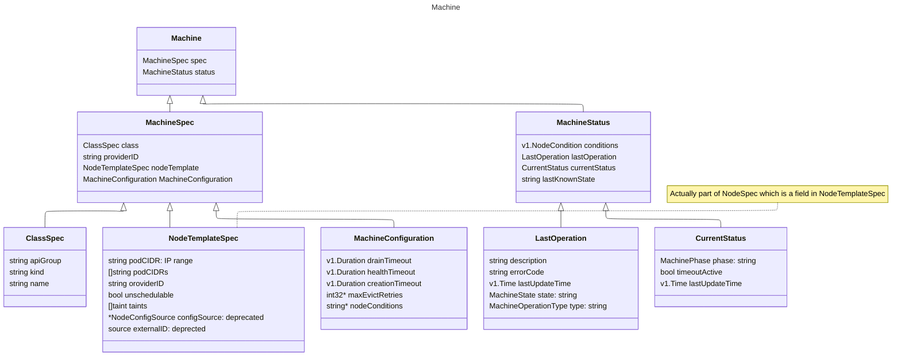
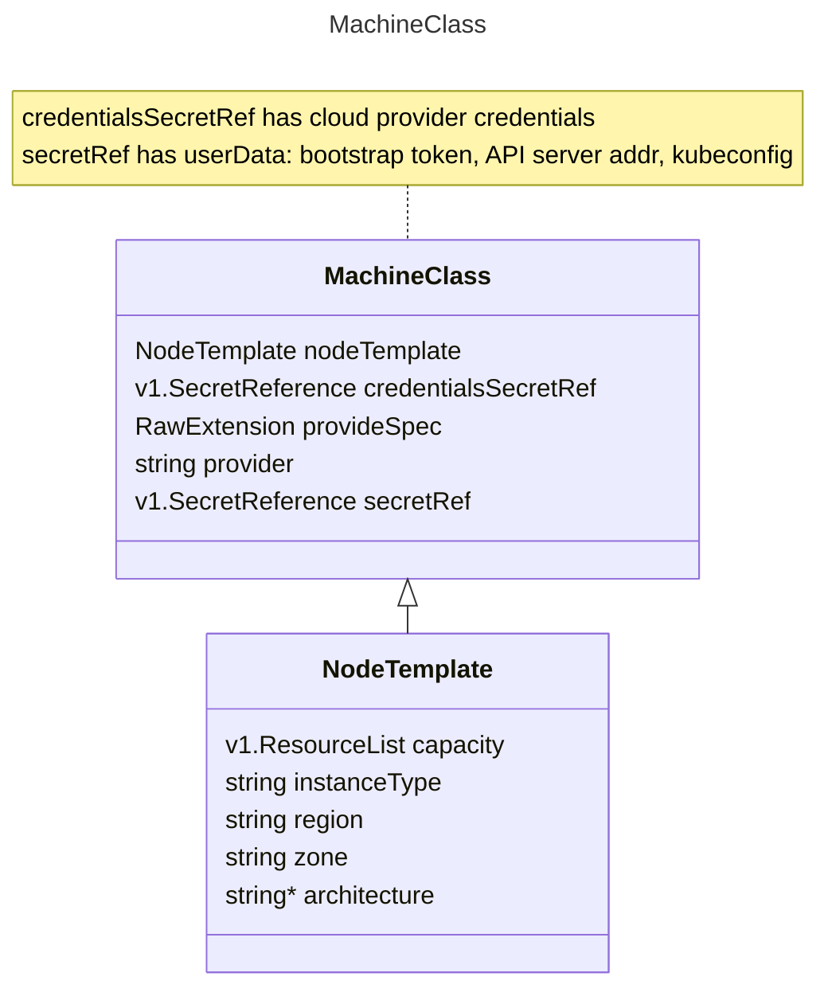
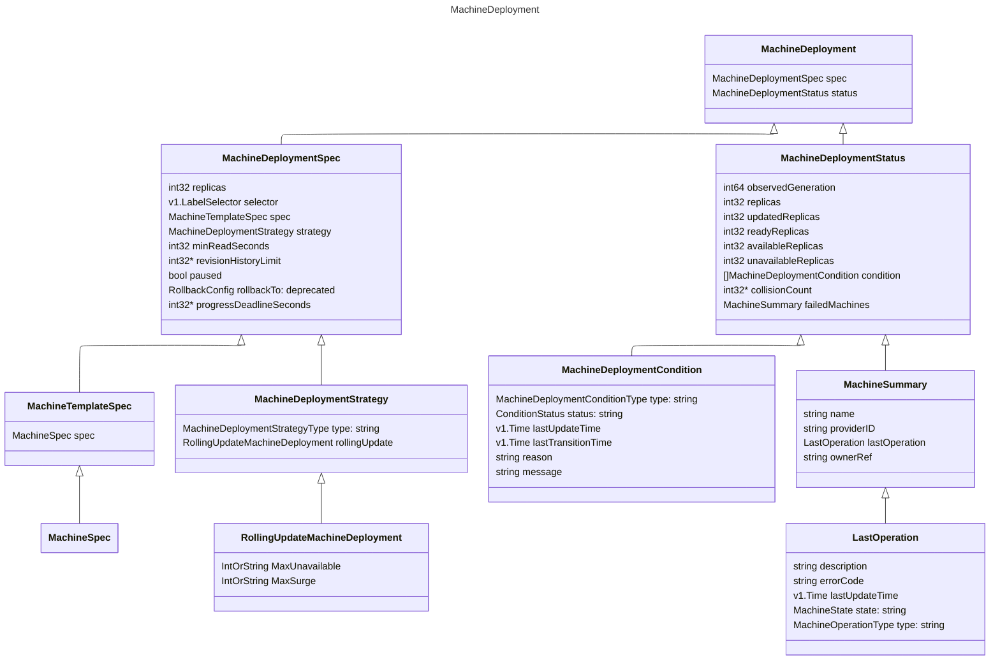
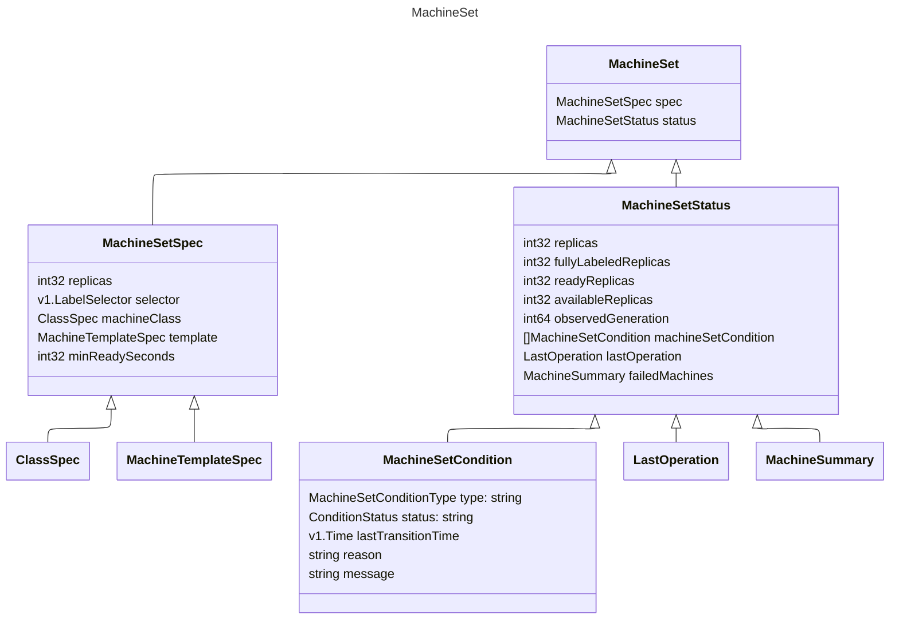

+++
title = "MCM"
author = ["Tak"]
date = 2024-11-29T16:07:00+05:30
tags = ["k8s", "sap", "work"]
draft = false
+++

## Components {#components}

## TODOs {#todos}

-   Check control and target clusters, inClusterConfig.
