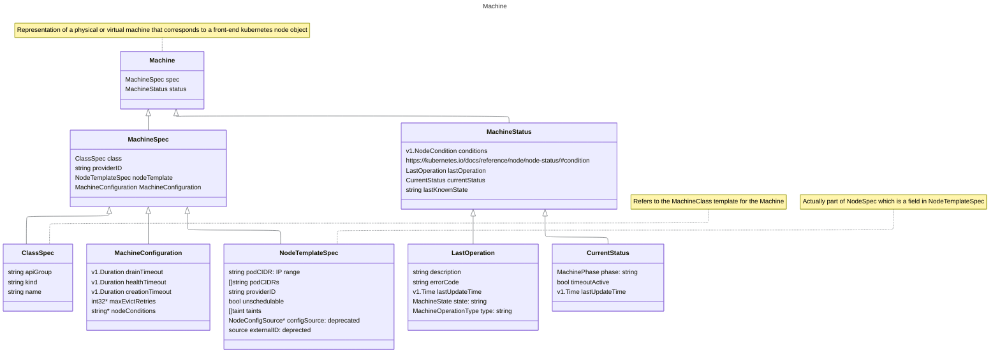
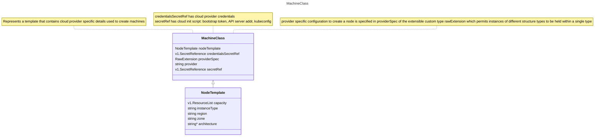
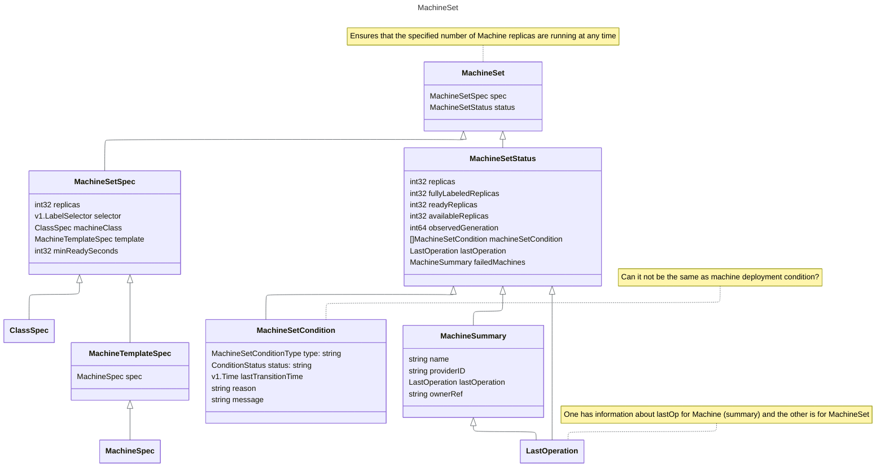
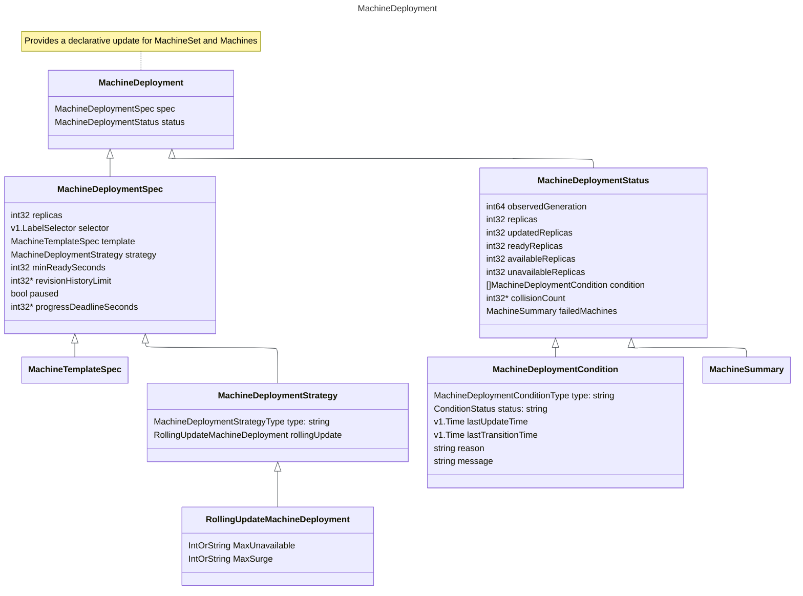

+++
title = "MCM"
author = ["Tak"]
date = 2024-11-29T16:07:00+05:30
tags = ["k8s", "work"]
draft = false
+++

First, go through the [README](https://github.com/gardener/machine-controller-manager/blob/master/README.md), later on check [local setup](https://github.com/gardener/machine-controller-manager/blob/master/docs/development/local_setup.md) guide as well.


## Components {#components}

Check [CRDs present in the MCM tree](https://github.com/gardener/machine-controller-manager/tree/master/kubernetes/crds)

<div class="warning">

All the below class diagrams omit `TypeMeta` and `ObjectMeta` for brevity.

</div>


### Machine {#machine}




### Machine Class {#machine-class}

<div class="mermaidbox">



</div>


### Machine Set {#machine-set}

<div class="mermaidbox">



</div>


### Machine Deployment {#machine-deployment}

<div class="mermaidbox">



</div>


## Controllers {#controllers}


### Reconcile Cluster Secret {#reconcile-cluster-secret}

1.  Fetch secrets
2.  Get the `MachineClass` referring to the passed secret
3.  In case there are machine classes that refer it, add the finalizer to the secret else remove it. (The removal of the finalizer is needed because if the secrets aren't referred by `MachineClass` then their deletion shouldn't depend on the finalizer, [Ref](https://kubernetes.io/docs/concepts/overview/working-with-objects/finalizers/))


### Reconcile Cluster Machine Class {#reconcile-cluster-machine-class}

1.  Fetch the `MachineClass`
2.  Get all the `Machines` referring to the `MachineClass`.
3.  If there are machines that match given `MachineClass` and the deletion hasn't been requested yet for the `Class` then add the finalizers to the class proceeding which all the machines referring to the class are enqueued for further processing. (`TODO`: Learn about [workqueue](https://pkg.go.dev/k8s.io/client-go/util/workqueue))
4.  Otherwise if deletion isn't scheduled and there are machines referring to the Class then add them to the `machineQueue`.
5.  If there aren't any machines referring to the `Class`, then the finalizers, if any, on it can be deleted.


### Reconcile Cluster Machine {#reconcile-cluster-machine}

1.  Fetch the required `Machine`.
2.  Check if the Machine controller is frozen (`safetyOptions.MachineControllerFrozen`) and machine isn't scheduled for deletion. If so, retry reconciliation after `longRetry`.
3.  If machine isn't frozen, then validate the `Machine` (check Name and Kind for the Class shouldn't be empty). Also validate the `MachineClass`' `Nodetemplate` fields (`capacity`: cpu, gpu and memory; `instanceType`, `region` and `zone`).
4.  In case the machine is scheduled for deletion, `triggerDeletionFlow` with a `DeleteMachineRequest`.
5.  If the `Machine` isn't scheduled for deletion, then add the finalizers on the machine if not present.
6.  `TODO`: Check [Machine Phases State Diagram](https://github.com/gardener/machine-controller-manager/blob/master/docs/FAQ.md#what-are-the-different-phases-of-a-machine)

    Check if the machine has an associated node (look for _label_ with key "`node`") and if the machine has been created (i.e. `phase` != "", if phase is empty string, that corresponds to machine being in creation stage). If so, then:

    -   Reconcile Machine Health: Updates the machine object with any change in node conditions or health. [Ref](https://elankath.github.io/mcmdesign/machine-controller/cluster_machine_reconcile.html#health-check-summary)
    -   Sync Machine Name to Node: Syncs machine name on corresponding node object by adding machine name label to metadata.
    -   Sync Machine NodeTemplates: Syncs `nodeTemplate` between the machine and the node object by fetching it, then syncs the _annotations_, _labels_ and _taints_ (ALT).
7.  If machine phase is `empty` or `crashloopbackoff` or `providerId` is empty i.e. machine doesn't exist then `triggerCreationFlow` with `CreateMachineRequest`.


#### TriggerDeletionFlow {#triggerdeletionflow}

Check out [FAQ: Why is my machine deleted?](https://github.com/gardener/machine-controller-manager/blob/master/docs/FAQ.md#why-is-my-machine-deleted)

1.  Check if finalizers are present on the machine, if not retry after a while.
2.  In case they are present and the machine isn't in `terminating` phase, then set it to `terminating`.
3.  If machine is in `terminating` phase, then check `LastOperation Description`:
    -   If it contains the string `GetVMStatus` i.e. "Set machine status to termination. Now, getting VM Status" then &lt; `TODO` &gt;
    -   If it contains the string `InitiateDrain` then call `drainNode` &lt; `TODO` Look into drainNode &gt;

<!--list-separator-->

-  DrainNode

    Check out [FAQ: How is drain implemented?](https://github.com/gardener/machine-controller-manager/blob/master/docs/FAQ.md#how-is-the-drain-of-a-machine-implemented)

    1.  Check that the nodeName is valid, if not set `skipDrain`.
    2.  Check if machine is in `Ready` or `ReadOnly` state.
    3.  If node condition is not empty and its not ready and it's been 5mins, then `forceDeleteMachines` and `forceDeletePods` are set.
    4.  If node condition is not empty and its read-only and it's been 5mins, then `forceDeleteMachines` and `forceDeletePods` are set.
    5.  If `skipDrain` is set, then set the state to `Processing`.
    6.  If skip isn't set, then check if (MachineDrainTimeout) has occured.

        -   If `force-deletion` label is present on the machine or if timeout has happened then `forceDeleteMachines` and `forceDeletePods` are set and force deletion is triggered otherwise normal deletion is triggered.

        <!--listend-->

        ```nil
           To perform forceful machine drain/delete either:
           1. force-deletion: "True" label must be present
           2. Deletion operation is more than drain-timeout minutes old
           3. Last machine drain had failed
        ```

        -
    7.


#### <span class="org-todo todo TODO">TODO</span> TriggerCreationFlow {#triggercreationflow}


## Queries {#queries}

-   How much access/info does the end user have about machines? How much can they control them or is the access restricted to editing nodes only?
-   Check control and target clusters, inClusterConfig. Control cluster is the one where the machine-\* objects are stored. Target cluster is where all the node objects are registered.
-   When node deletion checks are happening, how is the `ReadOnlyFileSystem` flag checked for?
-   Why is this required in two places? [FAQ: API Change](https://github.com/gardener/machine-controller-manager/blob/master/docs/FAQ.md#i-need-to-change-the-apis-what-are-the-recommended-steps)
-   In a lot of functions, we clone the resource, then work with the cloned copy, why is that necessary?
-   Why is bootstrap token deletion required when machine creation goes through?
-   What is this permit that's used when `Unknown` phase and machine times out
-   Why is internalExternalScheme conversion needed?
    ```go-ts
    // Validate internal to external scheme conversion. Why is this needed?
    class = &v1alpha1.MachineClass{}
    internalClass := &machine.MachineClass{}
    err := c.internalExternalScheme.Convert(class, internalClass, nil)
    if err != nil {
    	return err
    }
    ```
