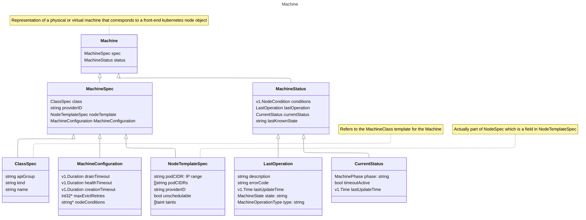

+++
title = "MCM"
author = ["Tak"]
date = 2024-11-29T16:07:00+05:30
tags = ["k8s", "work"]
draft = false
+++

First, go through the [README](https://github.com/gardener/machine-controller-manager/blob/master/README.md), later on check [local setup](https://github.com/gardener/machine-controller-manager/blob/master/docs/development/local_setup.md) guide as well.


## Components {#components}

Check [CRDs present in the MCM tree](https://github.com/gardener/machine-controller-manager/tree/master/kubernetes/crds)

<div class="warning">

All the below class diagrams omit `TypeMeta` and `ObjectMeta` for brevity.

</div>


### Machine {#machine}




### Machine Class {#machine-class}


### Machine Set {#machine-set}


### Machine Deployment {#machine-deployment}


## Controllers {#controllers}


### Reconcile Cluster Secret {#reconcile-cluster-secret}

1.  Fetch secrets
2.  Get the `MachineClass` referring to the passed secret
3.  In case there are machine classes that refer it, add the finalizer to the secret else remove it. (The removal of the finalizer is needed because if the secrets aren't referred by `MachineClass` then their deletion shouldn't depend on the finalizer, [Ref](https://kubernetes.io/docs/concepts/overview/working-with-objects/finalizers/))


### Reconcile Cluster Machine Class {#reconcile-cluster-machine-class}

1.  Fetch the `MachineClass`
2.  Get all the `Machines` referring to the `MachineClass`.
3.  If there are machines that match given `MachineClass` and the deletion hasn't been requested yet for the `Class` then add the finalizers to the class proceeding which all the machines referring to the class are enqueued for further processing. (`TODO`: Learn about [workqueue](https://pkg.go.dev/k8s.io/client-go/util/workqueue))
4.  Otherwise if deletion isn't scheduled and there are machines referring to the Class then add them to the `machineQueue`.
5.  If there aren't any machines referring to the `Class`, then the finalizers, if any, on it can be deleted.


### Reconcile Cluster Machine {#reconcile-cluster-machine}

1.  Fetch the required `Machine`.
2.  Check if the Machine controller is frozen (`safetyOptions.MachineControllerFrozen`) and machine isn't scheduled for deletion. If so, retry reconciliation after `longRetry`.
3.  If machine isn't frozen, then validate the `Machine` (check Name and Kind for the Class shouldn't be empty). Also validate the `MachineClass`' `Nodetemplate` fields (`capacity`: cpu, gpu and memory; `instanceType`, `region` and `zone`).
4.  In case the machine is scheduled for deletion, `triggerDeletionFlow` with a `DeleteMachineRequest`.
5.  If the `Machine` isn't scheduled for deletion, then add the finalizers on the machine if not present.
6.  Check [Machine Phases State Diagram](https://github.com/gardener/machine-controller-manager/blob/master/docs/FAQ.md#what-are-the-different-phases-of-a-machine)

    Check if the machine has an associated node (look for _label_ with key "`node`") and if the machine has been created (i.e. `phase` != "", if phase is empty string, that corresponds to machine being in creation stage). If so, then:

    -   Reconcile Machine Health: Updates the machine object with any change in node conditions or health. [Ref](https://elankath.github.io/mcmdesign/machine-controller/cluster_machine_reconcile.html#health-check-summary)
    -   Sync Machine Name to Node: Syncs machine name on corresponding node object by adding machine name label to metadata.
    -   Sync Machine NodeTemplates: Syncs `nodeTemplate` between the machine and the node object by fetching it, then syncs the _annotations_, _labels_ and _taints_ ().
7.  If machine phase is `empty` or `crashloopbackoff` or `providerId` is empty i.e. machine doesn't exist then `triggerCreationFlow` with `CreateMachineRequest`.


#### TriggerDeletionFlow {#triggerdeletionflow}

Check out [FAQ: Why is my machine deleted?](https://github.com/gardener/machine-controller-manager/blob/master/docs/FAQ.md#why-is-my-machine-deleted)
Check if finalizers are present on the machine, if not retry after a while. In case they are present and the machine isn't in `terminating` phase, then set it to `terminating`. If machine is in `terminating` phase, then check `LastOperation Description`:

1.  If it contains the string `GetVMStatus` i.e. "Set machine status to termination. Now, getting VM Status" then `updateMachineStatusAndNodeLabel` is called which adds the "`node`" label if not present while checking for any errors in getting machine error status. After confirming that the node label is updated, the LastOperation `type` is set to `delete` and LastOperation `description` to `InitiateDrain`.
2.  If it contains the string `InitiateDrain` then call `DrainNode`. (explained below)
3.  If its `DelVolumesAttachments`, then `deleteNodeVolAttachments` is invoked:
    -   If node is not found or if `node.Status.VolumesAttached` is zero then `description` is updated to `InitiateVMDeletion` and `state` is set to `Processing`.
    -   If there are non-zero attached volumes then `getLiveVolumeAttachmentsForNode` fetches all the volumes attached to our node not having DeletionTimestamp set.
    -   If there are live volumes, `deleteVolumeAttachmentsForNode` removes them and when zero live volumes are attached then `InitiateVMDeletion` is the `description`.
    -   After this the machine status is updated with the corresponding state and description.
4.  When it's `InitiateVMDeletion`, then `deleteVM` delgates the task to `driver.DeleteMachine()`. If deletion is successful then description is set to `InitiateNodeDeletion` with `processing` `state`. If there are any errors:
    -   In case its `NotFound`, then deletion flow is continued and `state` is set to `processing` with `description` being `InitiateNodeDeletion`.
    -   If it's `Unknown`, `DeadlineExceeded`, `Aborted` or `Unavailable` or any other error code(`default`) or failure in decoding the machineErr itself: the `state` is set as `failed` and `description` is `InitiateVMDeletion` as deletion is re-tried.
    -   After this the machine status is updated with the corresponding state and description.
5.  Whereas `InitiateNodeDeletion` calls upon `deleteNodeObject` which if can't find the associated node, continues the deletion flow with `description` set to `InitiateFinalizerRemoval` and `state` as `Processing` otherwise `Delete()` is called for the node which on success moves to `Processing` and `InitiateFinalizerRemoval` stages however on error switches to `failed` state (any error other than object not found). After this the machine status is updated.
6.  At last when we have `InitiateFinalizerRemoval`, `deleteMachineFinalizers` is invoked which deletes `MCMFinalizerName` if present, if there are any errors while updating the machine with the new set of finalizers, then re-queue is triggered after a ShortRetry.


#### DrainNode {#drainnode}

Check out [FAQ: How is drain implemented?](https://github.com/gardener/machine-controller-manager/blob/master/docs/FAQ.md#how-is-the-drain-of-a-machine-implemented), and the [flowchart](https://elankath.github.io/mcmdesign/machine-controller/mc_helper_methods.html#controllerdrainnode).

1.  Check that the nodeName is valid, if not set `skipDrain`.
2.  Check if machine is in `Ready` or `ReadOnly` state.
3.  If node condition is not empty and its `not Ready` or its `ReadOnly` and it's been 5mins, then `forceDeleteMachines` and `forceDeletePods` are set, `printLogInitError()` is called i.e. `description` is set to `InitiateVMDeletion`.
4.  If skip isn't set, then check if (MachineDrainTimeout) has occured.
    -   If `force-deletion` label is present on the machine or if timeout has happened then `forceDeleteMachines` and `forceDeletePods` are set and _force deletion_ is triggered otherwise _normal deletion_ is triggered.
    -   After that, `UpdateNodeTerminationCondition` is called, which checks that the `phase` is not `CrashLoopBackOff` or `empty` i.e. machine is not in creation stage. Then we check if there are nodes that are already in `terminating` condition, if not, then if `phase` is `failed` then `terminationCondition` reason is set to `Unhealthy`, otherwise it's set to `ScaleDown`.
    -   If termination condition update results in an error in a _normal deletion_ then, `skipDrain` is set and `state` is set to `failed`.
    -   If termination condition update doesn't result in an error then `RunDrain` (explained below) is invoked; if drain is successful then `state` is set to `Processing` &amp; if it's _normal deletion_ `description` is set to `InitiateVMDeletion` (since regular deletion already waits for volume detach/attach) otherwise if it's _force deletion_ then `description` is set to `DelVolumesAttachments`  alongwith `Processing` `state`. If `RunDrain` is unsuccessful however and its _normal deletion_ then `description` is set to `InitiateDrain` with `failed` `state` for a retry.
    -   To summarize the above:
        ```nil
           To perform forceful machine drain/delete either:
           1. force-deletion: "True" label must be present
           2. Deletion operation is more than drain-timeout minutes old
           3. Last machine drain had failed
        ```

5.  If `skipDrain` is set, then set the state to `Processing`, LastOperation `type` to `delete`, `description` is set to `InitiateVMDeletion` by `printLogInitError()` and it's re-queued.


#### RunDrain {#rundrain}

1.  drainContext
2.  `RunCordonOrUncordon`

    First we try to get the associated node, if it results in an error that means the node doesn't exist i.e. deletion was triggered during the machine creation process hence there's nothing to do. If the node is there and it's `Spec.Unschedulable` is true, then there's nothing to do otherwise `Unschedulable` is set to true. (_Cordoning_ means sealing off/preventing access)
3.  `WaitForCacheSync` is processed for the pod informer cache to sync.
4.  `deleteOrEvictPodsSimple`
    -   Calls `getPodsForDeletion` which lists all `pods.Spec.NodeName` matching our node, (TODO: check podFilter) and if there aren't any errors, then returns the list of pods.
    -   Following which we `deleteOrEvictPods`: Here, we first check if the server supports eviction by `SupportEviction` and if `ForceDeletePods` is false then we call `evictPods` which performs _normal eviction_ of the pods, parallelly `evictPodsWithoutPv` and serially (by sorting by Priority) `evictPodsWithPv` for ones having volume attached since it needs to wait for volume detachment. Both of these ways attempt to `evictPod` if supported for `MaxEvictRetries` times failing which they `deletePod`. If `forceDeletePods` is true, then _forceful eviction_ of the pods happens and all pods are evicted parallelly by calling `evictPodsWithPv`.
    -   `TODO` Look into `getPdbForPod`, `isMisconfiguredPdb`, `TerminationGracePeriod`, `waitForDelete`: [evictPodsWithoutPVInternal](https://elankath.github.io/mcmdesign/machine-controller/node_drain.html#drainoptionsevictpodwithoutpvinternal)
    -   `TODO` Check [evictPodsWithPVInternal](https://elankath.github.io/mcmdesign/machine-controller/node_drain.html#drainoptionsevictpodswithpvinternal)
    -   If there are any failures in `deleteOrEvictPods`, they are reported as pendingPods.


#### TriggerCreationFlow {#triggercreationflow}

1.  Update MachineRequest's secret by processing the secret with (TODO) `addBootstrapTokenToUserData` and `addMachineNameToUserData` which checks if `secret["userData"]` exists, then replacing `MachineNamePlaceholder` &lt;MACHINE_NAME&gt; with the actual `machine.Name`.
2.  After that, the secret is used alongwith the Machine and MachineClass to create a GetMachineStatusRequest which responds with `providerId` and associated `nodeName`.
3.  If there is no error with the GetMachineStatusRequest and the machine's "node" label or `providerID` is empty then the required VM is found and the node and providerID for the machine is updated. (`updateLabels`: adds the necessary labels, annotations with MachinePriority as 3 if unset and updates the providerID)
4.  If there is an error in getting the machine status and the ErrCode is `NotFound` or `Unimplemented` and if the "node" label is not present on the machine then: `driver.CreateMachine()` is invoked which on success gives us the `providerId` and the `nodeName`, then we try to `Get()` (TODO: nodeName != machineName significance?) the returned `nodeName` to check if a node object already exists. If so, it is treated as a stale node and `driver.DeleteMachine()` is triggered and the machine object is marked as `state` `failed`, `phase` being `failed`  with LastOperation `description` set as "`VM using old node obj`" and then its status is updated. NOTE: Also, `uninitializedMachine` is set to true.
5.  If the returned codes are `Unknown`, `DeadlineExceeded`, `Aborted` or `Unavailable`, then again `machineStatusUpdate` is called with `state` set to `failed` and `phase` being `failed` or `crashloopbackoff` depending upon whether or not MachineCreationTimeout happened.
6.  Whereas the case when returned code is `Uninitialized`, the flag `uninitializedMachine` is set to true. In any other scenario, a `machineStatusUpdate` call similar to the previous case is made with a re-queue call.
7.  In case the `uninitializedMachine` flag is set, `initializeMachine` is called for starting the VM instance for the machine, it delegates the task to `driver.InitializeMachine` which if it returns `Unimplemented` error code, then VM initialization is skipped as provider doesn't support it otherwise `machineStatusUpdate` call is made with `failed` `state` and `crashloopbackoff` or `failed` `phase` based on MachineCreationTimeout. Upon successful initialization, an error is returned by `triggerCreationFlow` for another re-queue.
8.  If however the machine `phase` is `empty` (creation) or `crashloopbackoff` then `state` is set as `Processing`, `phase` as `Pending` and a `UpdateStatus` call is made for the machine.


## Queries {#queries}

-   How much access/info does the end user have about machines? How much can they control them or is the access restricted to editing nodes only?
-   Check control and target clusters, inClusterConfig. Control cluster is the one where the machine-\* objects are stored. Target cluster is where all the node objects are registered.
-   When node deletion checks are happening, how is the `ReadOnlyFileSystem` flag checked for?
-   Why is this required in two places? [FAQ: API Change](https://github.com/gardener/machine-controller-manager/blob/master/docs/FAQ.md#i-need-to-change-the-apis-what-are-the-recommended-steps)
-   What is this `FakeDriver` business?
-   In a lot of functions, we clone the resource, then work with the cloned copy, why is that necessary?
-   Why is bootstrap token deletion required when machine creation goes through?
-   What is this permit that's used when `Unknown` phase and machine times out
-   Why is internalExternalScheme conversion needed?
    ```go-ts
    // Validate internal to external scheme conversion. Why is this needed?
    class = &v1alpha1.MachineClass{}
    internalClass := &machine.MachineClass{}
    err := c.internalExternalScheme.Convert(class, internalClass, nil)
    if err != nil {
    	return err
    }
    ```
