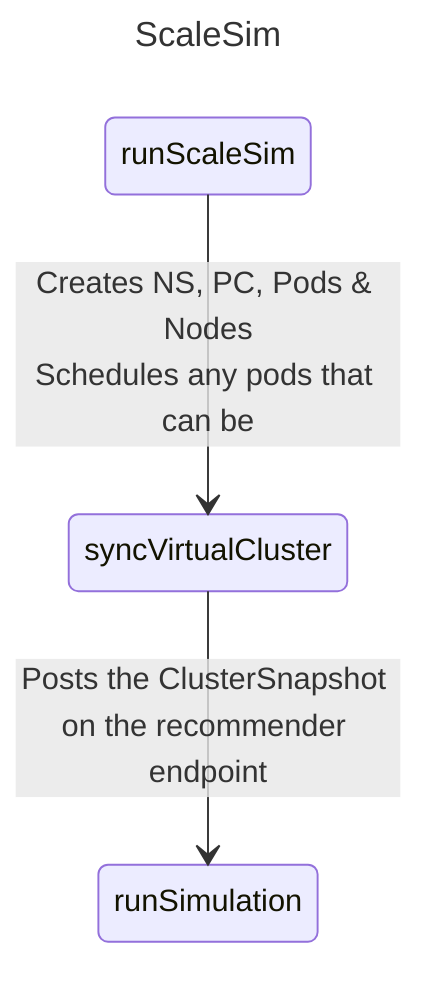
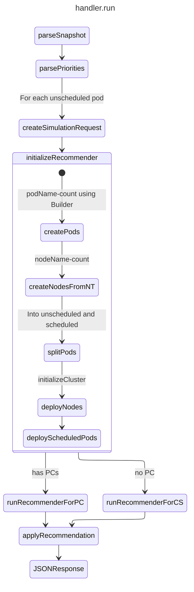
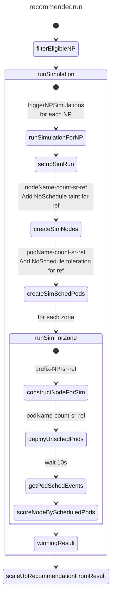

+++
title = "Scaling Recommender Flow"
author = ["Prashant Tak"]
lastmod = 2025-06-04T12:16:24+05:30
draft = false
creator = "Emacs 30.1 (Org mode 9.7.11 + ox-hugo)"
+++

```mermaid
---
title: ScaleSim
config:
    layout: elk
---
stateDiagram-v2
    runScaleSim --> syncVirtualCluster : Creates NS, PC, Pods & Nodes<br/>Schedules any pods that can be
    syncVirtualCluster --> runSimulation : Posts the ClusterSnapshot on the recommender endpoint
```

```mermaid
---
title: handler.run
config:
    layout: elk
---
stateDiagram-v2

    state "initializeRecommender" as iR {
        [*] --> createPods : podName-count using Builder
        createPods --> createNodesFromNT : nodeName-count
        createNodesFromNT --> splitPods : Into unscheduled and scheduled
        splitPods --> deployNodes : initializeCluster
        deployNodes --> deployScheduledPods
    }

    parseSnapshot --> parsePriorities
    parsePriorities --> createSimulationRequest : For each unscheduled pod
    createSimulationRequest --> iR
    iR --> runRecommenderForPC : has PCs
    iR --> runRecommenderForCS : no PC
    runRecommenderForPC --> applyRecommendation
    runRecommenderForCS --> applyRecommendation
    applyRecommendation --> JSONResponse
```

```mermaid
---
title: recommender.run
config:
    layout: elk
---
stateDiagram-v2
    state "runSimForZone" as rSZ {
        [*] --> constructNodeForSim : prefix-NP-sr-ref
        constructNodeForSim --> deployUnschedPods : podName-count-sr-ref
        deployUnschedPods --> getPodSchedEvents : wait 10s
        getPodSchedEvents --> scoreNodeByScheduledPods
    }

    state "runSimulation" as rS {
        [*] --> runSimulationForNP : triggerNPSimulations<br/>for each NP
        runSimulationForNP --> setupSimRun
        setupSimRun --> createSimNodes : nodeName-count-sr-ref<br/>Add NoSchedule taint for ref
        createSimNodes --> createSimSchedPods : podName-count-sr-ref<br/>Add NoSchedule toleration for ref
        createSimSchedPods --> rSZ : for each zone
        rSZ --> winningResult
    }

    [*] --> filterEligibleNP
    filterEligibleNP --> rS
    rS --> scaleUpRecommendationFromResult
```
