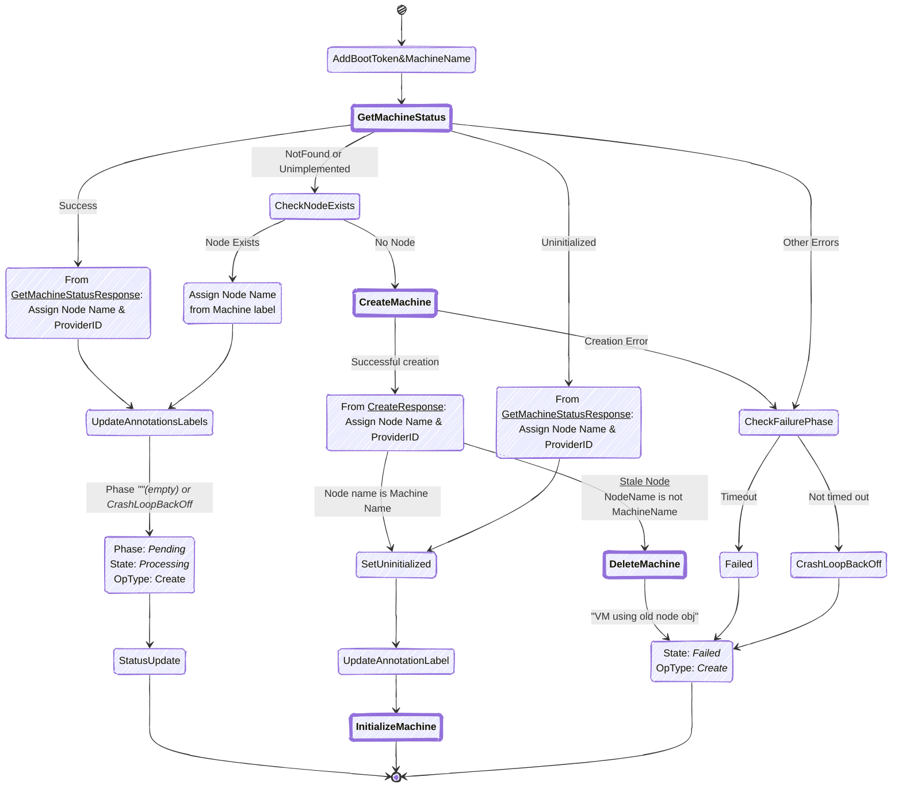

+++
title = "2 Fast 2 MCM"
author = ["Tak"]
date = 2025-01-15T00:07:00+05:30
draft = false
+++

These visual representations helps understand the complex workflows within the Machine Controller Manager.

## Machine Controller Manager Architecture
- The system consists of three main controllers working in concert
- Each controller handles specific aspects of machine lifecycle management
- Interfaces with both cloud providers and Kubernetes clusters
- Manages the full lifecycle of machines from creation to deletion

Let's start with an overview of the main components and their interactions:

## Machine Controller Core Flows
Now, let's dive into the Machine Controller's core reconciliation flows for different resources. It handles three main types of reconciliation:
- Secret Reconciliation: Manages secrets referenced by MachineClasses
- MachineClass Reconciliation: Handles machine class lifecycle
- Machine Reconciliation: Core machine lifecycle management

### Machine Creation
Machine Creation Flow:
- Complex process involving multiple status checks
- Handles initialization and error cases
- Includes node verification and cleanup of stale resources
- Multiple retry mechanisms for resilience

### Health Check

### Machine Deletion
Machine Deletion Flow:
- Carefully orchestrated process to ensure clean resource cleanup
- Involves multiple phases from drain to final cleanup
- Handles volume attachments and node cleanup
- Includes finalizer management for resource protection

Let's visualize the Node Drain process, which is a critical part of machine deletion:
- Sophisticated pod eviction handling
- Supports both forced and normal drain scenarios
- Handles PDB (Pod Disruption Budget) violations
- Includes parallel and serial eviction strategies

## Safety Controller
1. Orphan VM Check:
   - Runs periodically (every 15 minutes) to detect and clean up orphaned VMs
   - Lists all VMs in the cloud provider matching the cluster's tag
   - Maps VMs to machine objects using ProviderID
   - Handles nodes without machine objects:
     + Adds `NotManagedByMCM` annotation after timeout
     + Removes annotation if machine object is found
   - Logs all cleanup operations for audit purposes

2. API Server Safety:
   - Monitors connectivity to both control and target API servers
   - Implements a freezing mechanism when API servers are unreachable
   - Manages machine controller state based on API server health:
     + Freezes operations if timeout exceeded
     + Unfreezes when API servers become available
   - Handles machine status updates during API server recovery

## MachineSet Controller
1. Core Reconciliation:
   - Validates MachineSet specifications
   - Manages finalizers for proper cleanup
   - Implements machine ownership through controller references
   - Synchronizes node templates and configurations

2. Replica Management:
   - Implements sophisticated scaling logic:
     - Slow-start batching for scale-up operations
     - Prioritized scale-down based on machine health
   - Handles stale machine cleanup
   - Maintains desired replica count
   - Updates status to reflect current state

## MachineDeployment Controller
Deployment Management:
- Handles multiple MachineSets for a deployment
- Maintains deployment history through revisions
- Supports pausing and resuming deployments
- Implements rollback functionality

1. Deployment Strategies:
   - Recreate Strategy:
     - Scales down old MachineSets completely
     - Creates and scales up new MachineSet
     - Ensures clean cutover between versions
   
   - Rolling Update Strategy:
     - Gradually scales up new MachineSet
     - Gradually scales down old MachineSets
     - Maintains availability during updates
     - Handles surge and unavailability constraints

2. Scaling Operations:
   - Detects and handles scaling events
   - Manages desired replica counts across MachineSets
   - Updates annotations for autoscaler integration
   - Ensures proper resource cleanup

## Summary
Each of these controllers implements sophisticated error handling and retry mechanisms:
1. Error Handling:
   - Categorizes errors into recoverable and non-recoverable
   - Implements exponential backoff for retries
   - Maintains error counters and conditions
   - Updates status to reflect error states

2. Resource Protection:
   - Uses finalizers to prevent premature deletion
   - Implements owner references for proper garbage collection
   - Maintains consistent state through careful status updates
   - Handles race conditions through proper locking

3. Performance Considerations:
   - Implements work queues for efficient processing
   - Uses informers for efficient cache handling
   - Batches operations when possible
   - Implements rate limiting for API calls

4. Monitoring and Metrics:
   - Tracks operation durations
   - Records error counts and types
   - Provides health metrics
   - Implements proper logging for debugging

The entire system works together to provide:
1. Reliable machine lifecycle management
2. Proper cleanup of resources
3. Scaling capabilities
4. Rolling updates and rollbacks
5. Protection against race conditions and API server issues
6. Efficient resource utilization
7. Proper monitoring and debugging capabilities

This comprehensive system ensures robust machine management while maintaining high availability and proper resource utilization. The controllers work together to maintain the desired state while handling various edge cases and failure scenarios.
